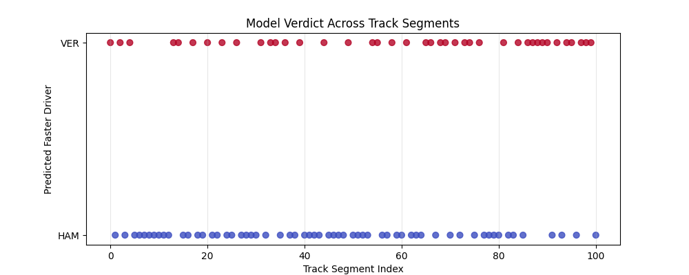
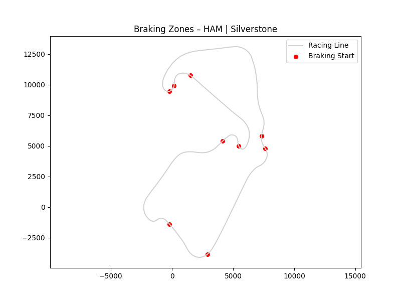
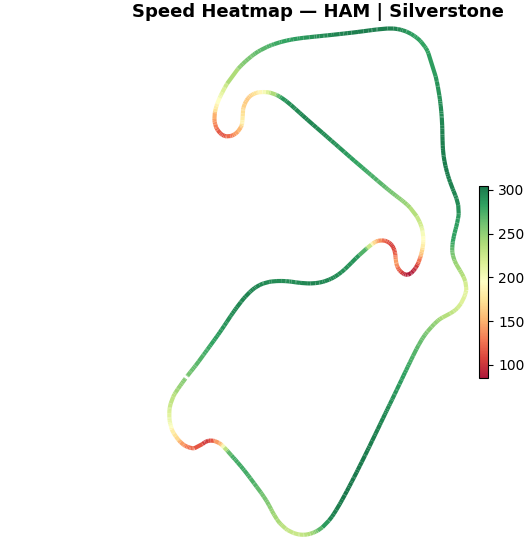
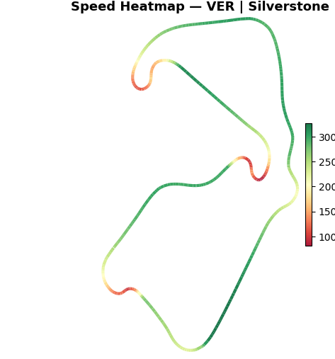
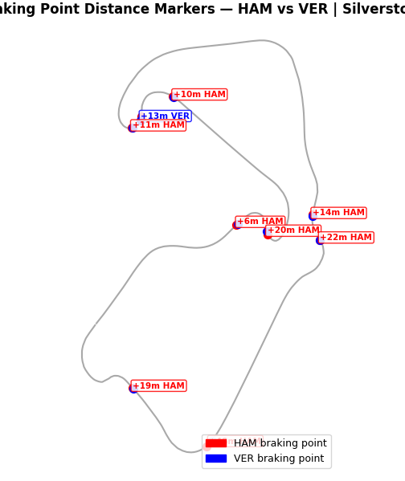
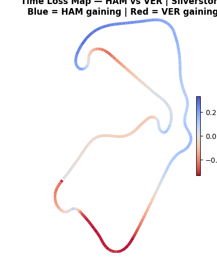
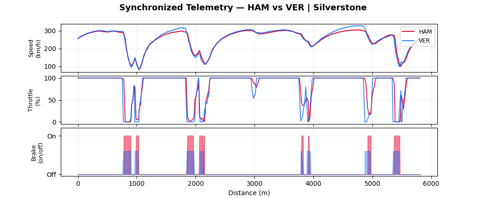
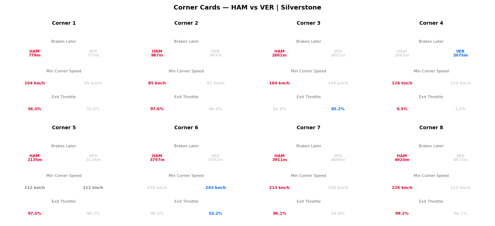
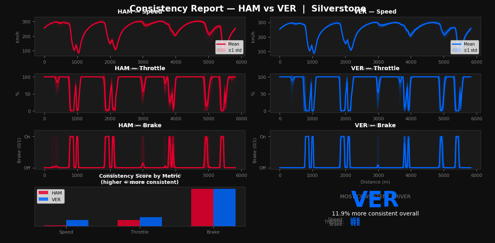

# 🏎️ F1 Telemetry Intelligence System

A machine learning–driven Formula 1 telemetry analysis project that compares driver performance at a segment level using braking zones and telemetry data.

---

## 🚀 Features

- Telemetry Analysis using FastF1 API  
- Machine Learning Model (Random Forest) to predict faster driver per segment  
- Track Segmentation based on braking zones  
- Advanced Visualizations:
  - Braking zone comparison
  - Speed heatmaps
  - Time loss maps
  - Synchronized telemetry traces
  - Corner-by-corner performance cards
  - Driver consistency dashboard

---

## 🧠 How It Works

1. Session Data Collection using FastF1  
2. Segmentation based on braking points  
3. Feature Engineering per segment  
4. Model Training using Random Forest  
5. Visualization of performance insights  

---

## 📁 Project Structure

F1_main.py  
F1_segmentation.py  
F1_features.py  
F1_visualization.py  
F1_telemetry.py  
segments_dataset.csv  
cache/  

---

## ⚙️ Installation

pip install fastf1 pandas matplotlib scikit-learn scipy

---

## ▶️ Usage

python F1_main.py  

---

## 📊 Model Details

Features:
- avg_speed
- min_speed
- max_speed
- avg_throttle
- brake_ratio
- segment_length  

Target:
- Faster driver per segment  

---

## 📸 Output Examples

---

## 🔮 Future Improvements

- Deep learning models  
- Real-time race analysis  
- Web dashboard  
- Multi-driver comparison  

---

## 🤝 Contributions

Open to improvements and feature additions.
